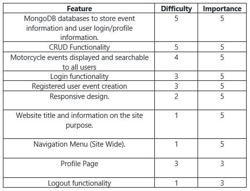

# Motorbike Event Finder

The Motorbike Event Finder does exactly what it says on the tin. It's a place where users can create and view 
Motorbike Events. The live Website can be found [here]().

## Table of Contents
* [User Experience Design (UX)](#User-Experience-Design)
    * [The Strategy Plane](#The-Strategy-Plane)
        * [Site Goals](#Site-Goals)
        * [User stories](#User-Stories)
    * [The Scope Plane](#The-Scope-Plane)
    * [The Structure Plane](#The-Structure-Plane)
    * [The Skeleton Plane](#The-Skeleton-Plane)
        * [Wireframes](#Wireframes)
        * [Database Design](#Database-Design)
    * [The Surface Plane](#The-Surface-Plane)
        * [Design](#Design)
            * [Colour Scheme](#Colour-Scheme)
            * [Typography](#Typography)
            * [Imagery](#Imagery)
    * [Differences to Design](#Differences-to-Design)
- [Features](#Features)
    * [Existing Features](#Existing-Features)
    * [Future Features](#Features-Left-to-Implement)
* [Technologies](#Technologies)
* [Testing](#Testing)
    * [Test Strategy](#Test-Strategy)
    * [Test Results](#Test-Results)
    * [Isses and Resolutions](#Issues-and-Resolutions-to-issues-found-during-testing)
* [Deployment](#Deployment)
    * [Project Creation](#Project-Creation)
    * [GitHub Pages](#Deployment-To-Heroku)
    * [Locally](Run-Locally)
* [Credits](#Credits)
  * [Content](#Content)
  * [Acknowledgements](#Acknowledgements)

****

## User Experience Design
### **The Strategy Plane**

Although many events are advertised on social media, it can be difficult to keep track and keep record of them
as there is no single 'one page fits all'. As a biker himself, my client has requested this website for not only
his own personal use but for the local biking community to have easily accessible information in one place.

This website was created for client Gareth G as a 'One Stop Shop' for event loving bikers. The aim is to provide
users with a simple website that allows them to quickly find or create Motorbike Events that can be shared with
other motorcycle enthusiasts. All historical events should be recorded, although they do not have to  be displayed
 as this data will not be needed until phase two enhancements of the website.

#### Site Goals
* To increase the number of participants in Motorbike events by providing a simple, easy to use website that
contains all the details of upcoming events.
* Increase funds raised for charity by the Site owners personal motorcycle club through advertising their events
on the website.

#### User stories
* As a user, I want the main purpose of the site to be clear so that I immediately know what the site is 
intended for upon entering.
* As a user, I want to easily navigate the site so that I can find content quickly with ease.
* As a user, I want the website to be responsive so that I can clearly view the webpages from my mobile, 
tablet or desktop.
* As a user, I want to be able to register to the website so that I can create and manage my own events.
* As a user, I want to be able to search or filter events based on custom criteria so that I can find events
 suited to me.
* As a user, I want a way to contact the site owner so that I can have any questions I may have in 
regards to the website answered.
* As a user, I want to be able to return to the main site without having to use the browser buttons so 
that I can easily return to the website if I navigate to a page that doesn't exist.

### **The Scope Plane**

**Features planned:**
* Responsive design.
* Website title and information on the site purpose.
* Navigation Menu (Site Wide).
* MongoDB databases to store event information and user login/profile information.
* CRUD Functionality
* Login functionality.
* Logout functionality.
* Profile Page
* Motorcycle events displayed and searchable to all users.
* Registered user event creation and management.

### **The Structure Plane**
User Story:
> As a user, I want the main purpose of the site to be clear so that I immediately know what the site is 
intended for upon entering.

Acceptance Criteria:
* Site heading and Logo to be displayed on the main navigation bar on all pages.
* Home Page to display information to the user on the purpose of the site.

Implementation:

A site logo and header with the website name will be displayed on the main navigation menu. This should be 
displayed on all webpages.

A detailed description of the site will be displayed on the Home page so that is evident of the websites
purpose as soon as the user visits the site.

User Story:
> As a user, I want to easily navigate the site so that I can find content quickly with ease.

Acceptance Criteria:
* Navigation menu to be displayed on all pages.
* All navigation links redirect to the correct pages.

Implementation:

A navigation menu will be displayed on all webpages. This will redirect users to the approriate page when 
clicked. On mobile devices, the menu will be collapsable to make efficient use of space on smaller screen
sizes. 

The following navigation items will be implemented:

* Home - index.html
* Sign Up - register.html
* Sign In - login.html
* Profile - profile.html
* Events - events.html
* Create Event - create-event.html
* Contact - contact.html
* Sign Out - (redirects to home page)

User Story:
> As a user, I want the website to be responsive so that I can clearly view the webpages from my mobile, 
tablet or desktop.

Acceptance Criteria:
* Content should be responsive and display clearly on all devices with no horizontal scroll.

Implementation:

Materialize will be used for website layout with suitable column sizes and containers to ensure
that all content is displayed clearly on all devices with no horizonal scroll. Images will be responsive and 
scale to fit screen sizes with no stretch or distortion to ensure clear images are displayed to the user.

User Story:
> As a user, I want to be able to register to the website so that I can create and manage my own events.

Acceptance Criteria:
* Sign up - Login and Logout functionality to be added.
* User must have the ability to create, update and delete their own events.
* User must have a profile page displaying their basic details and events they have created.
* Only the creator of the events should have the ability to update or delete the events.

Implementation:

A Sign Up page will be implemented that allows users to register for an account on the website. The username
and password along with basic details for the users account will be stored in a MongoDB database collection 
called users. In order to create or modify events, a user will have to register and login to the website. 
Only the creator of the event will have the ability to update or delete the event, this is to prevent 
unwanted modification or deletion of events by other users. A flash message will be shown to the user to 
alert them whether the update or delete on their event was successful or failed.

A Sign In page will be implemented to allow registered users the ability to login in to their account. 

Once a user has successfully logged in, they will be redirected to their profile page. The users basic 
details will be displayed on their profile, along with any events they have created. The user will be able 
to update or delete their events from the profile page. This page will only be available to logged in users,
this includes the visibility of the navigation menu item.

A Sign Out button will be displayed to users who are logged in. When clicked this will sign the user out of the 
website and redirect them to the home page.

A Create Event page will be implemented that will be acessible and visible on the navigation menu to logged 
in users. The user will be able to create an event from this page. The event information will be stored in 
a MongoDB database collection called events and the event categories will be stored in a MongoDB collection 
called categories.

User Story:
> As a user, I want to be able to search or filter events based on custom criteria so that I can find events
 suited to me.

Acceptance Criteria:
* Events must be displayed to all users regardless of being logged in.
* Users should be able to search for events by Date, Location or Event Type.

Implementation:

An Events page will be implemented that is displayed to all users that is accessible to logged in or guests. 
This page will display the next six motorbike events from today's date on materialize cards. In order to 
make use of space, these events will be collapsable and can be expanded to view details on click.

A search box will be displayed on screen which will allow users to search for events based on Date, Event 
Type or Location. This will return a filtered, full list of future events for the current search criteria. 
This will be implemented by using a database index that will be created on the MongoDB collection events.

User Story:
> As a user, I want a way to contact the site owner so that I can have any questions I may have in 
regards to the website answered and receive feedback to alert on status of form submission.

Acceptance Criteria:
* Contact page should be added with a contact form. This form should only submit with valid data input.
* Contact form should not submit with invalid data input.
* User should be alerted of success/failure status of form submission.

Implementation:

A contact page will be added that contains a materialize form, this will allow users to contact the site 
owner. The EmailJS API will be used in order to implement this feature and a flash message will be 
displayed to alert the user if the contact form submitted successfully or unsuccessfully.

Validation will be performed on the form to ensure valid data input. The form will not submit if any 
field is blank.

Form Fields:
* Name - Type: Text, Max length: 50 chars, required.
* Email - Type: Email, Max length: 50 chars, required.
* Comments - Type: TextArea, Max length: 1500 characters, required.

User Story:
> As a user, I want to be able to return to the main site without having to use the browser buttons so 
that I can easily return to the website if I navigate to a page that doesn't exist.

Acceptance Criteria:
* If a user redirects to the wrong page, an error will display that contains a link to go back to the main 
website.

Implementation:

A custom 404 page will be created so that if a user attempts to nagiate to a page that it not found, an 
error will be displayed. This page will contain a clickable anchor link to allow the user to redirect to 
the main website without needing to use the browser navigation buttons.

### **The Skeleton Plane**
#### Wireframes
* [Home](static/images/wireframes/home.pdf)
* [404](static/images/wireframes/404.pdf)
* [Contact](static/images/wireframes/contact.pdf)
* [Create Event](static/images/wireframes/create_event.pdf)
* [Edit Event](static/images/wireframes/edit_event.pdf)
* [Events](static/images/wireframes/events.pdf)
* [Profile](static/images/wireframes/profile.pdf)
* [Sign In](static/images/wireframes/signin.pdf)
* [Sign Up](static/images/wireframes/signup.pdf)

#### Database Design
MongoDB Object format examples:

**Collection: categories** 
{ 
&nbsp;&nbsp;&nbsp;&nbsp;_id: unique-value, 
&nbsp;&nbsp;&nbsp;&nbsp;event_type: "Rally" 
}

**Collection: events** 
{ 
&nbsp;&nbsp;&nbsp;&nbsp;_id: unique-value, 
&nbsp;&nbsp;&nbsp;&nbsp;event_type: "Rally", 
&nbsp;&nbsp;&nbsp;&nbsp;location : "Wexford", 
&nbsp;&nbsp;&nbsp;&nbsp;date : "09 February, 2021", 
&nbsp;&nbsp;&nbsp;&nbsp;description : "This Rally is hosted by Unicorn MCC.", 
&nbsp;&nbsp;&nbsp;&nbsp;organiser : "Daisy McGirr" 
}

**Collection: users** 
{ 
&nbsp;&nbsp;&nbsp;&nbsp;_id: unique-value, 
&nbsp;&nbsp;&nbsp;&nbsp;username: "Admin", 
&nbsp;&nbsp;&nbsp;&nbsp;password : "12a6yt&jddn", 
&nbsp;&nbsp;&nbsp;&nbsp;name : "Jane Doe", 
}

### **The Surface Plane**
### Design

#### Colour Scheme

#### Typography

#### Imagery

#### Differences to Design

****
## Features

### Existing Features

### Features Left to Implement

****
## Technologies

****
## Testing

### Test Strategy
#### **Summary**

#### **High Level Test Cases**

#### **Access Requirements**

#### **Regression Testing**

#### **Assumptions and Dependencies**

#### **Out of Scope**

### Test Results

### Issues and Resolutions to issues found during testing

****
## Deployment

### Project Creation
To create this project I used the CI Gitpod Full Template by navigating 
[here](https://github.com/Code-Institute-Org/gitpod-full-template) and clicking the 'Use this template' button.

I was then directed to the create new repository from template page and entered in my desired repo name, then 
clicked Create repository from template button.

Once created, I navigated to my new repository on GitHub and clicked the Gitpod button which built my workspace.

The following commands were used for version control throughout the project:

* git add *filename* - This command was used to add files to the staging area before committing.

* git commit -m "commit message explaining the updates" - This command was used to to commit changes to the local repository.

* git push - This command is used to push all committed changes to the GitHub repository.

### Deployment to Heroku

### Run Locally
1. Navigate to the GitHub [Repository](https://github.com/Daisy-McG/Motorbike-Event-Finder).
1. Click the Code drop down menu.
1. Either Download the ZIP file, unpackage locally and open with IDE (This route ends here) OR Copy Git URL from the HTTPS dialogue box.
1. Open your developement editor of choice and open a terminal window in a directory of your choice.
1. Use the 'git clone' command in terminal followed by the copied git URL.
1. A clone of the project will be created locally on your machine.

****
## Credits

### Code

### Acknowledgements

****
