# Test Results

An additional test case (TC021) was added that was not included in the High Level Test cases in the Test Strategy.
This was added to cover testing of the User Story " As a user, I want the main purpose of the site to be clear so 
that I immediately know what the site is intended for upon entering." as this was missed in the original planning.

Full test results can be found in an excel document [here](testing/test_results.xlsx)

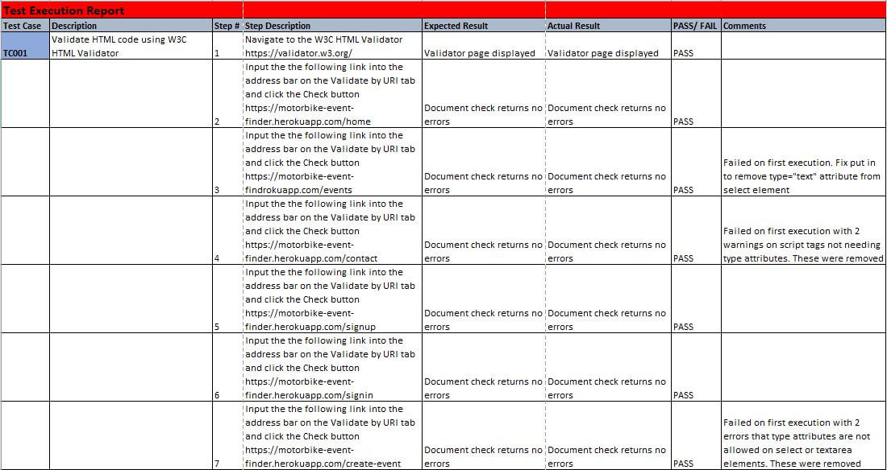
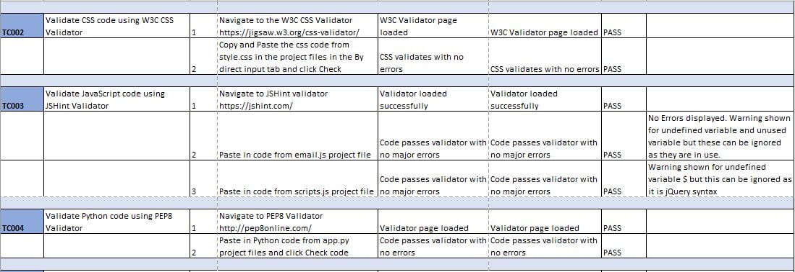
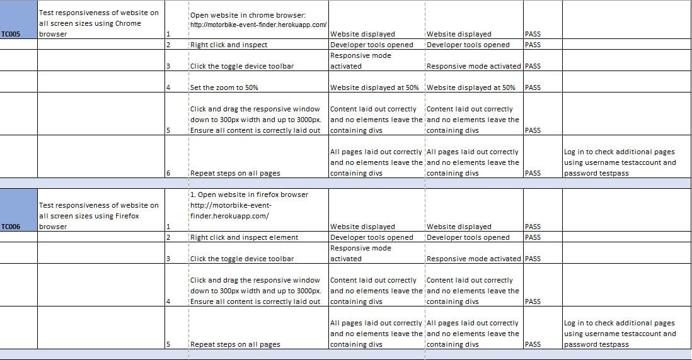
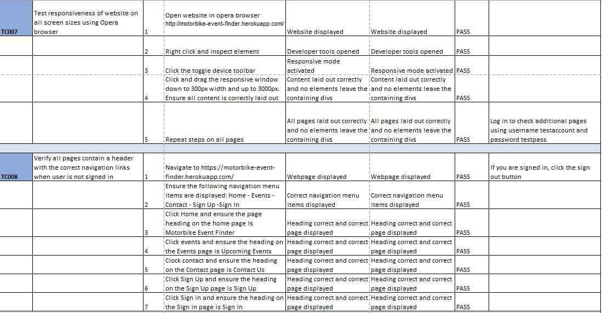
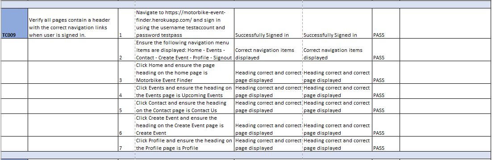
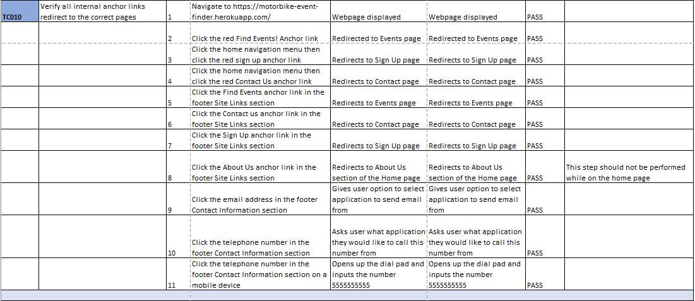
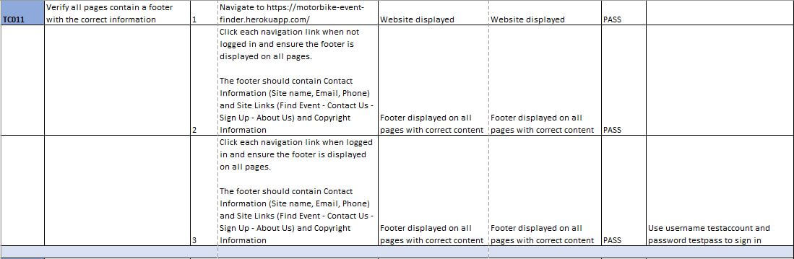
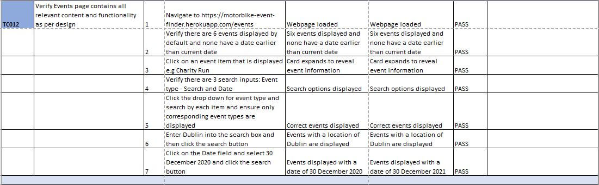

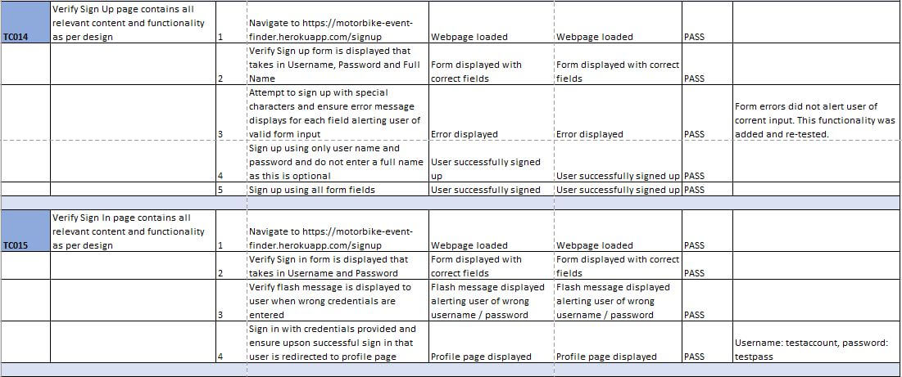
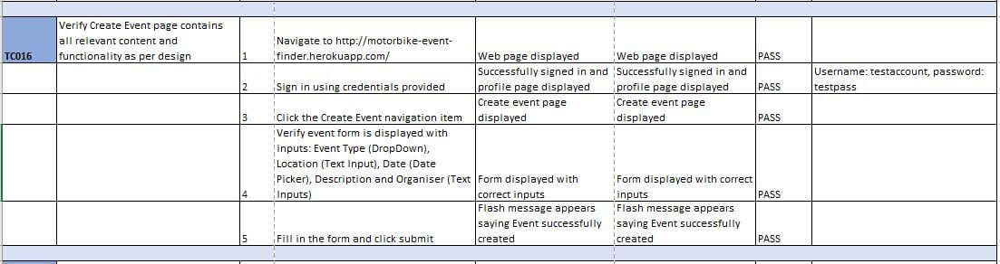
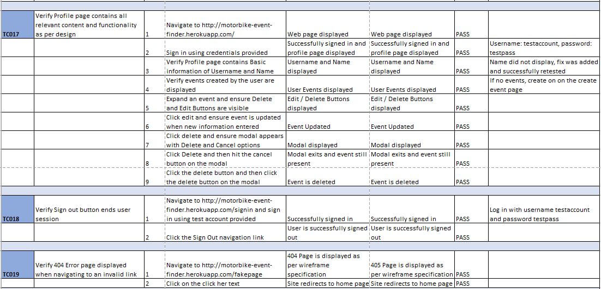
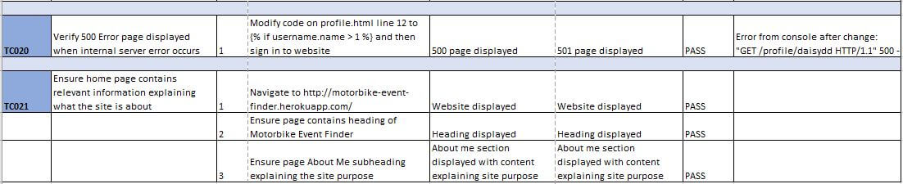

## User Story Testing

### User Story:
> As a user, I want the main purpose of the site to be clear so that I immediately know what the site is intended for upon entering.

Tests Covering story:
* TC021

### User Story:
> As a user, I want to easily navigate the site so that I can find content quickly with ease.

Tests Covering story:
* TC008
* TC009
* TC010

### User Story:
> As a user, I want the website to be responsive so that I can clearly view the webpages from my mobile, tablet or desktop.

Tests Covering story:
* TC005
* TC006
* TC007

### User Story:
> As a user, I want to be able to register to the website so that I can create and manage my own events.

Tests Covering story:
* TC014
* TC015
* TC016
* TC017
* TC018

### User Story:
> As a user, I want to be able to search or filter events based on custom criteria so that I can find events suited to me.

Tests Covering story:
* TC012

### User Story:
> As a user, I want a way to contact the site owner so that I can have any questions I may have in regards to the website answered.

Tests Covering story:
* TC013

### User Story:
> As a user, I want to be able to return to the main site without having to use the browser buttons so that I can easily return to the website if I navigate to a page that doesn't exist.

Tests Covering story:
* TC019

***
## Issues and Resolutions to issues found during testing of deployed website

Issue #1: 
> TC001 - Step 3: Failed validation on type="text" being invalid attribute on select element.

FIX - This was resolved by removing the type="text" attribute.

Issue #2:
> TC001 - Step 4: Failed validation with warning on script tags not needing type attributes.

FIX - This was fixed by removing the type attribute.

Issue #3:
> TC014 - Step 3: Forms did not alert user of correct inputs into the Sign Up form.

FIX - This was resolved by adding custom error messages directly on the form fields.

Issue #4:
> TC017 - Step 3: Users "Name" is not displaying on profile when collection field is not blank.

FIX - This issue was resolved by removing the return field ["username"] and updating the profile code to search for correct values.

Issue #5:
> TC017 - Step 9: Wrong event was being deleted. No matter what event is deleted, the first one was being deleted.

FIX - This issue was caused by the event modals all having the same ID. This was resolved by updating the modal IDs to contain the event ID to make them unique. 
This was restested and is now working as expected.

Issue #6:
> TC012 - Step 5: Location search is also bringing back results when date or event type are searched.

FIX - This issue was resolved by updating the code in the search function to specify field values instead of a text field on the whole index.

***
## Issues and Resolutions to issues found during development testing
Issue #1: 
> On small devices on the Sign Up form, the label text was over lapping the text input 

This was resolved by 
removing the (Optional) text from the label and adding it as placeholder text.

Issue #2:
> Form labels missing. During a lighthouse report generation, it was found that many form elements across the 
website were missing labels. 

This was fixed by adding labels to the form elements.

Issue #3:
> Anchor link on home page main content section was redirecting to the Events page. 

This was fixed by correcting the url_for to 'signup'.

Issue #4:
> Event type wasn't populating the drop down list on the events page.

This was resolved by correcting the url_for link and passing caregories list to the template.

Issue #5:
> When sorting events by date (string) from MongoDB collection, they were sorting on the days instead of full dates.

This was resolved by parsing the dates into datetime objects and then sorting them.

Issue #6:
> Heading for user events on profile was always showing even when the user had no events. This was caused by not filtering
the events before passing the events to the profile page. This ment the list contained all events but only displayed the 
users events due to the conditional logic on the profile page. 

This was resolved by doing a filter on the events before returning the events to the profile page. Redunant session user 
checks were then removed from the profile.html page.

***
## Unit Testing

Unit testing was done using python [unittest](https://docs.python.org/3/library/unittest.html).

Testing covered: 

* Routing to ensure they navigated to the correct pages.
* Sign Up functionality.
* Login functionality.
* Create Event functionality.
* Edit Event functionality.
* Delete Event functionality.

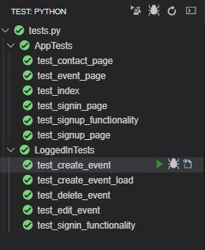 
****

## Validator Results

#### HTML Results:
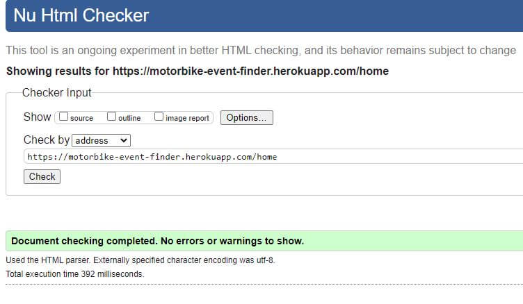 
![Events]testing/tc001_step3.JPG() 
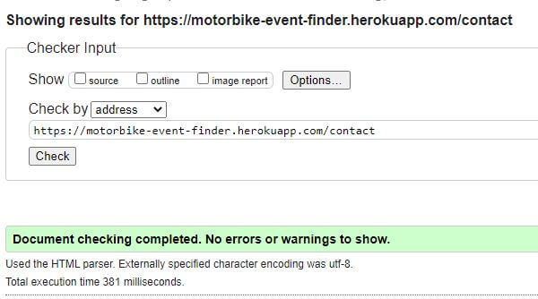 
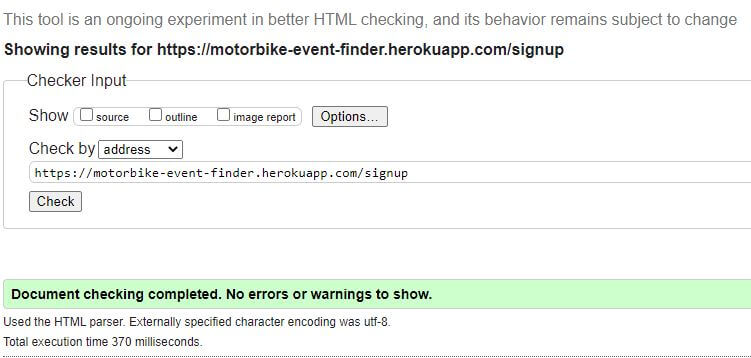 
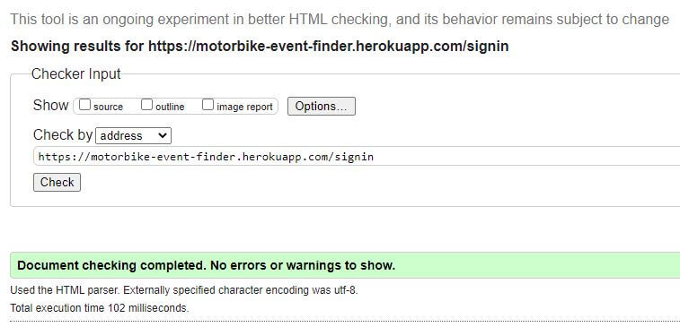 

#### CSS Results:
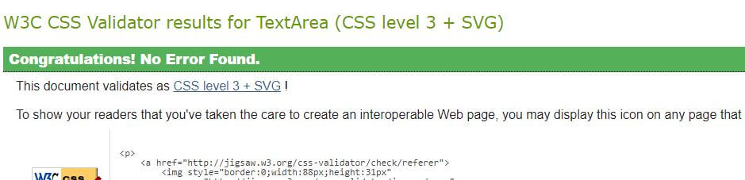 

#### JavaScript Results:
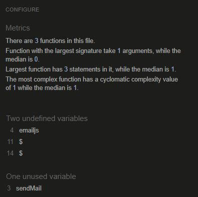 
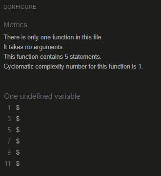 

#### Python Results:
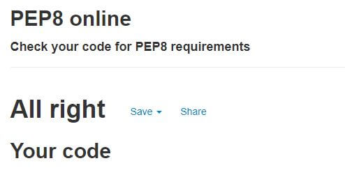 